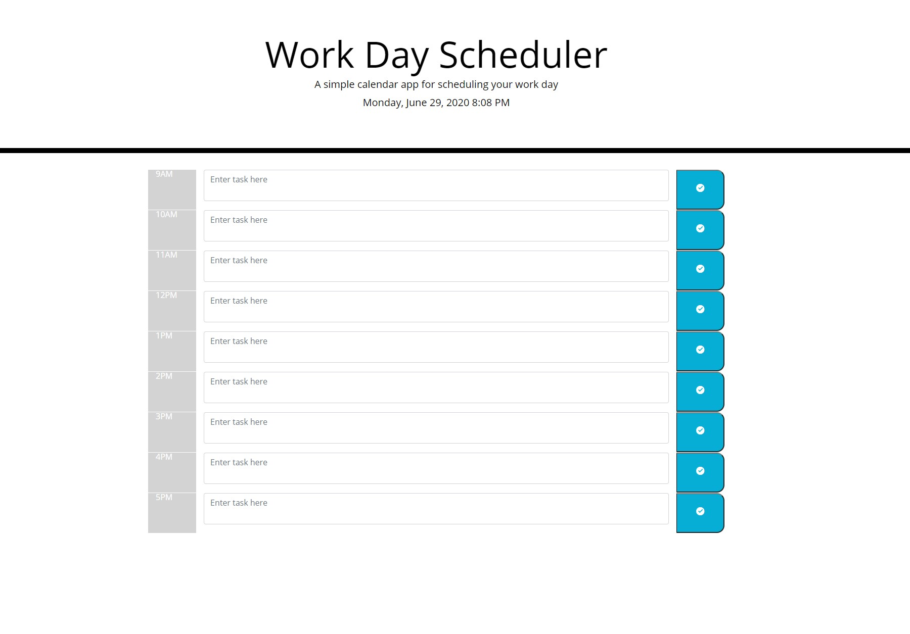

# Work Day Scheduler

Create a day scheduler using Bootstrap, JQuery, and Momoment.js

https://kwedwick.github.io/weekday-scheduler/

https://github.com/kwedwick/weekday-scheduler

## Table of Contents

- [Planning](#planning)
- [Issues](#issues)
- [Screenshot](#screenshot)

## Planning

1. First I needed to build out the bootsrap rows and columns to contain the time schedule
2. Next was the find the kind of text box I needed to use
3. When I had the bootstrap div's planned, I looked at the CSS to place them accordingly. Some weren't entirely used and may rework them later.
4. JavaScript was then planned out:
    - Started with getting the time and date done on top to have it refresh every second to match the time up as much as possible
    - Linked the text box with the save button
    - Then coded to save and load functions 
    - Finally, needd the hourly tasks to change color based on the hours
        - Ultimately, I didn't like the text fields changing color because I thought it was tacky and hard to read so I put them on the time column. If this would be a directive, I would potentially have the background color outsdie of the text box change color instead to keep readability high.

## Issues

There is one issue that could be resolved/added beyond the scope of the assignment

1. I would create a button to clear out the tasks so when they come in for the day, they can do that. Or even a delete button next to each task
2. I would potentially like a "Mark Completed" section as well

## Screenshot

Here is the screenshot of the main page

